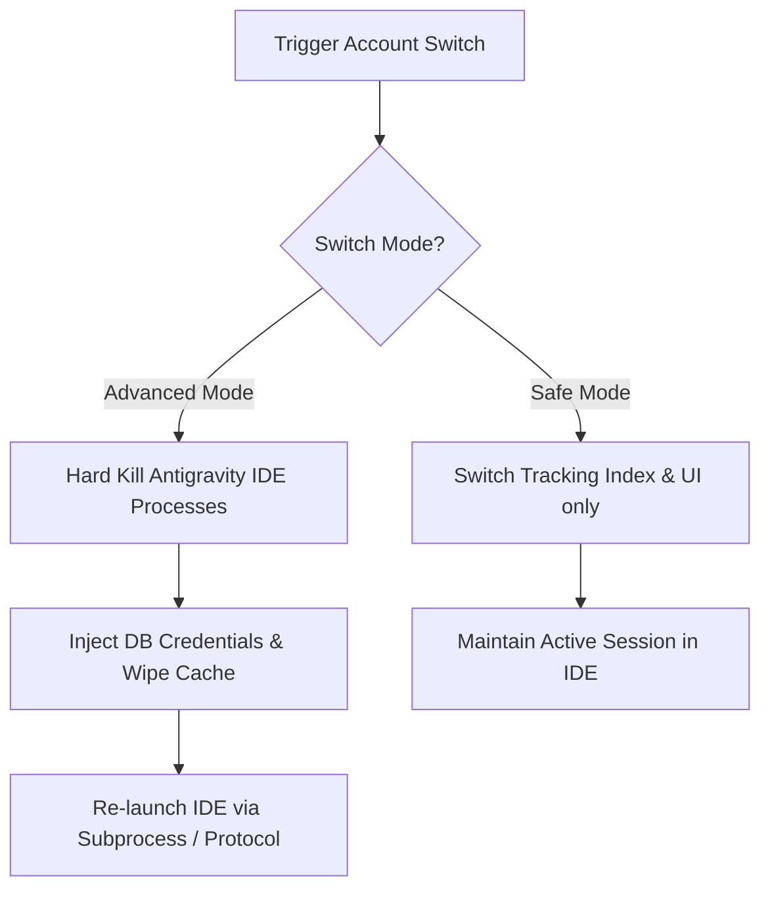

# 🛡️ Antigravity Mission Hub

[](https://github.com/Anbu-2006/Antigravity-Mission-Control)
[](https://code.visualstudio.com)
[](https://github.com/Anbu-2006/Antigravity-Mission-Control)
[](https://opensource.org/licenses/MIT)

> **Antigravity Mission Hub** is a cyber-professional multi-account command center and AI token economy optimizer built specifically for the **Antigravity IDE**. Gain full observability into your active LLM subscriptions, route models intelligently, and switch active profiles seamlessly without interruption.

---

## 📥 Installation

**Antigravity Mission Hub** is officially published and available for download on both major extension registries:

- 🔵 **[Microsoft VS Code Marketplace](https://marketplace.visualstudio.com/items?itemName=anbudev.ag-mission-hub-anbudev)** (For standard Visual Studio Code users)
- 🟣 **[Open VSX Registry](https://open-vsx.org/extension/anbudev/ag-mission-hub-anbudev)** (For Antigravity IDE, VSCodium, Gitpod, and Eclipse Theia users)

---

## 🌟 Core Architecture & Key Capabilities

### 1. 📊 Advanced Telemetry & Glassmorphism Dashboard
- **Obsidian Dark & Cyberpunk Palette**: Visual interface with curated translucent panels, vibrant progress gauges, and active status indicators.
- **Friendly Model Identifier**: Automatically maps cryptic system model IDs (like `gemini-3.1-pro-low`) into human-readable, premium display labels (such as **Gemini 3.1 Pro (Low)** and **Claude Sonnet 4.6 (Thinking)**).
- **Traffic Network Pulse**: Live status indicators for the Google Antigravity backend, reporting outage, maintenance, and rate-limit states dynamically via **StatusGator integration**.

### 2. ⚡ Frictionless Switch Engine & Protocol Routing
- **Windows Silent Protocol Fallback**: Employs background `cmd /c start` sub-spawning instead of legacy `explorer.exe` protocol calls, completely bypassing Windows "Application not found" popup dialogs when URI protocols are unconfigured.
- **Auto-Injectors**: Quietly populates credential tokens directly into the `.vscdb` storage layer and purges stale auth states (`antigravityAuthStatus` / `antigravityQuotaCache`) to ensure instant authentication.
- **Method Rotator**: Seamlessly cascades from direct system subprocess execution to lightweight shell protocol triggers.

### 3. 🗺️ Custom Model Routing & Group Management
- **Logical Model Grouping**: Create custom routes (e.g. Claude series, Gemini Flash) to group your models for clear quota tracking.
- **Dynamic Group Telemetry**: The VS Code status bar updates dynamically to show the lowest remaining quota within each active route (e.g., `🟢 CLAUDE [80%] | 🟡 GEMINI [35%]`).
- **Autogrouping Algorithm**: Automatically parses available models and organizes them by version/tier.

### 4. 🔑 Credential Portability & Token Management
- **Token Export**: Export active refresh tokens to the clipboard for secure migration or backup.
- **Batch Export/Import**: 1-click backup of all registered accounts and tokens into a single formatted JSON payload, allowing seamless synchronization across developer machines.
- **Refresh Token Login**: Log in directly using a raw refresh token, bypassing the default browser redirect flow.

### 5. 🛡️ Network Resilience & VPN Hardening
- **SSL-Inspection Shield**: Detects when corporate firewalls or VPNs block backend handshakes (e.g. self-signed certificates, leaf verification failures) and automatically suspends background telemetry loops to prevent a retry/request storm.
- **Active Handshake Guard**: Verifies backend subscription status on startup before releasing queries, preventing rapid account bans or immediate 429 locks.

### 6. 🧹 Sterile Trajectory Clean (Corrupted Session Rescue)
- **1-Click Trajectory Scrubbing**: Purges transient directory states (`.antigravity/` and `.jetski/`) from your active workspace.
- **Zero-Risk to Source Code**: Completely preserves actual project files while resetting broken agent loops and index corruptions.
- **Git Worktree Coexistence**: Resolves Git repository blocks by resetting stale git attributes (`worktreeConfig = true` / repository version downgrades) introduced by external CLI tools.

### 🩺 Environmental & Terminal Health Diagnostics
- **Environment自检**: Diagnostic page evaluating Node.js environment paths, database locations, database keys, and configuration overrides.
- **Terminal Prompt Stream Guard**: Evaluates bash, zsh, and powershell profiles to detect prompts (like Oh-My-Posh, Starship, Powerlevel10k) that inject ANSI/OSC control sequences. This warns users about potential telemetry stream corruptions before they cause "Agent Terminated" errors.

---

## 🚀 Two Switch Modes

Modify your active profile using either of the built-in operating behaviors:



---

## ⚙️ Configuration & Settings

Fine-tune extension behaviors directly via VS Code settings (`settings.json`):

| Setting Key | Type | Default | Description |
| :--- | :--- | :--- | :--- |
| `antigravity-mission-hub.switchMode` | `enum` | `"advanced"` | Switch method: `"advanced"` (automatic process kill and restart) or `"safe"` (graceful background injection). |
| `antigravity-mission-hub.autoRefreshInterval` | `integer` | `5` | Background telemetry polling interval in minutes (`0` to disable auto-refresh entirely). |
| `antigravity-mission-hub.processWaitSeconds` | `integer` | `10` | Waiting limit (in seconds) to let lingering IDE background tasks cleanly terminate during reload. |
| `antigravity-mission-hub.databasePathOverride` | `string` | `""` | Manual override path to the IDE sqlite db (`state.vscdb`). Leave blank for automated directory traversal. |

---

## ⌨️ Shortcuts & Hotkeys

- **Quick Health Rotation**: Press `Ctrl+Shift+A` (or `Cmd+Shift+A` on macOS) to instantly switch active credentials to the profile containing the highest integrity level and healthiest quota.

---

## 📦 Developer Guide: Building from Source

Package the extension locally to verify code changes or install manually:

1. **Install Dependencies & Compile TS**:
   ```bash
   npm install
   npm run compile
   ```
2. **Package into VSIX**:
   ```bash
   npx vsce package --no-git-tag-version
   ```
3. **Install manually**:
   Open Command Palette (`Ctrl+Shift+P`) → type `Extensions: Install from VSIX...` → Select the generated `.vsix` file.

---

## 📜 License

This project is licensed under the MIT License. See [LICENSE](file:///E:/Vibe coding/Antigravity-Mission-Control/LICENSE) for details.
